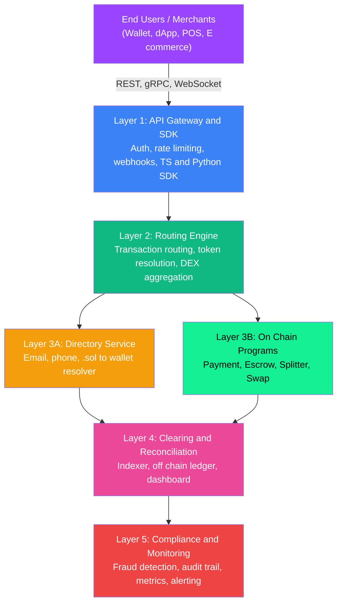

<div align="center">


# SolUPG

### The Universal Payment Gateway for Solana

<p align="center">
  <strong>One Integration. Every SPL Token. Instant Settlement.</strong>
</p>

<p align="center">
  <a href="#quick-start"></a>
  <a href="#documentation"></a>
  <a href="#deployment"></a>
  <a href="LICENSE"></a>
  <a href="https://github.com/revengerrr/solupg/stargazers"></a>
</p>

<p align="center">
  
  
  
  
  
  
</p>

<p align="center">
  <a href="#what-is-solupg">About</a> ·
  <a href="#features">Features</a> ·
  <a href="#architecture">Architecture</a> ·
  <a href="#quick-start">Quick Start</a> ·
  <a href="#api-reference">API</a> ·
  <a href="#roadmap">Roadmap</a> ·
  <a href="#contributing">Contributing</a>
</p>

</div>

---

## What is SolUPG?

**SolUPG (Solana Universal Payment Gateway)** is open payment infrastructure for the Solana ecosystem. It gives developers, merchants, and communities a single, programmable rail to accept any SPL token, settle instantly, and route funds anywhere on chain.

Think of it as the GPN of Indonesia or the UPI of India, reimagined for Solana: one unified network that connects wallets, merchants, and payment providers, with sub second finality and fees measured in fractions of a cent.

Every on chain program, every off chain service, and every SDK in this repository is open source under Apache 2.0. You can integrate it as a library, self host the full stack, or fork it and make it yours.

### The Problem

Crypto payments today are broken in five concrete ways:

- **Fragmentation**. Every token, wallet, and protocol speaks a different language. Merchants end up writing custom integrations per token.
- **Poor merchant experience**. Accepting crypto still feels like 2014: copy a raw wallet address, hope the sender picks the right token and amount.
- **No universal routing**. If a payer holds SOL but a merchant wants USDC, someone has to bridge, swap, and settle manually.
- **Opaque settlement**. Reconciliation across chains, tokens, and wallets is a spreadsheet nightmare.
- **High friction for identity**. There is no simple way to pay someone by their email, phone, or handle. You need the full base58 wallet address.

### The Solution

SolUPG solves all five with a layered architecture:

- **One gateway** for any SPL token. Pay in BONK, receive in USDC, the routing engine handles the swap automatically via Jupiter.
- **Instant settlement** through Solana native finality. No batching, no T+2, no holds.
- **Verified Payment Identity**. Link an email, phone number, or `.sol` domain to a wallet with OTP verification. Pay a handle, not a base58 blob.
- **On chain escrow and splitter** for marketplaces, payroll, and revenue share out of the box.
- **Off chain clearing and compliance** layers for reconciliation, fraud detection, and audit trails.
- **Open standard**. No permission needed, no vendor lock in, no platform fees at the protocol level.

---

## Features

<table>
<tr>
<td width="50%">

### On Chain Payment Primitives
Four audited ready Anchor programs: `solupg-payment`, `solupg-escrow`, `solupg-splitter`, `solupg-swap`. Build marketplaces, payroll, subscriptions, or escrowed trades with a few lines of SDK code.

### Universal Token Routing
The routing engine picks the best path: direct transfer, Jupiter swap, escrow release, or splitter distribution. Payers and merchants never think about which token is in flight.

### Verified Payment Identity
Pay someone by `ahmad@gmail.com`, `+628123456789`, or `merchant.sol`. OTP verification, preferred token config, and fee split rules travel with the identity.

</td>
<td width="50%">

### Merchant SDK and REST API
Official TypeScript SDK (`@solupg/sdk`) plus a versioned REST API with API key auth, JWT sessions, rate limiting, and webhooks. Python SDK coming next.

### Clearing and Reconciliation
A background indexer tails every on chain event, writes to Postgres, and reconciles against off chain intents. Merchants get a dashboard that actually balances to the cent.

### Fraud Detection and Audit Trail
Real time rule based fraud detection, append only audit log, Prometheus metrics, and alerting hooks. Everything you need to pass a compliance review.

</td>
</tr>
</table>

### Feature Status

| Feature | Description | Status |
|---|---|---|
| On Chain Payment Program | Core transfer primitive | Shipped |
| On Chain Escrow Program | Conditional fund holding | Shipped |
| On Chain Splitter Program | Multi party fee distribution | Shipped |
| On Chain Swap Program | Jupiter integration for auto swap | Shipped |
| Routing Engine | Intelligent payment path selection | Shipped |
| Directory Service | Email, phone, `.sol` to wallet | Shipped |
| REST API Gateway | Auth, rate limiting, webhooks | Shipped |
| TypeScript SDK | `@solupg/sdk` | Shipped |
| Clearing Engine | Indexer, reconciliation, dashboard | Shipped |
| Monitoring | Fraud detection, audit, metrics | Shipped |
| Docker Compose Stack | Full stack one command deploy | Shipped |
| CI, Security, E2E Tests | 5 workflows, k6 load suite, threat model | Shipped |
| Mainnet Program Deploy | Production program deployment | Planned |
| Audit Firm Review | Third party security audit | Planned |
| Python SDK | `solupg` on PyPI | Planned |

---

## Architecture

SolUPG is split into five clean layers. Every layer can be replaced, scaled, or deployed independently.



For a line by line walkthrough see [`docs/architecture/`](./docs/architecture/).

### Tech Stack

| Layer | Technology | Why |
|---|---|---|
| On Chain Programs | Rust, Anchor 0.29 | Battle tested Solana framework |
| Routing Engine | Rust, Axum, Tokio | Lowest latency async runtime on the JVM free side |
| API Gateway | Rust, Axum | Shared binary style, single compile toolchain |
| Directory Service | Rust, Postgres, Redis | OTP state in Redis, identities in Postgres |
| Clearing Engine | Rust, Postgres | Streaming indexer, idempotent reconciliation |
| Monitoring | Rust, Prometheus | Native metric exporter, alert hooks |
| SDK | TypeScript, `@solana/web3.js` | First class DX for JS, Node, and web |
| Infra | Docker Compose, GitHub Actions, k6 | One command stack plus CI plus load tests |

---

## Quick Start

Three ways to get going, in increasing order of commitment.

### Method 1: Use the TypeScript SDK

The fastest way to add SolUPG to an existing app.

```bash
npm install @solupg/sdk
```

```ts
import { SolUPG } from "@solupg/sdk";

const client = new SolUPG({
  baseUrl: "https://api.solupg.io",
  apiKey: process.env.SOLUPG_API_KEY,
});

// Create a payment intent
const payment = await client.createPayment({
  payer: "PAYER_WALLET",
  recipient: { wallet: "MERCHANT_WALLET" },
  sourceToken: "SOL",
  destinationToken: "USDC",
  amount: 1_000_000, // 1 USDC in lamports
});

console.log("Payment ID:", payment.id);
console.log("Status:", payment.status);
```

### Method 2: Self Host the Full Stack

Boot the entire five service stack in one command.

```bash
git clone https://github.com/revengerrr/solupg.git
cd solupg/services

docker compose build
docker compose up -d

# Health probes
curl http://localhost:3000/health  # routing engine
curl http://localhost:3001/health  # directory service
curl http://localhost:3002/health  # api gateway
curl http://localhost:3003/health  # clearing engine
curl http://localhost:3004/health  # monitoring
```

That gives you Postgres, Redis, and all five Rust services wired together, on the `solupg-net` Docker network, with healthchecks.

### Method 3: Build From Source

For contributors, auditors, or anyone wanting to deploy custom programs.

**Prerequisites**: Rust 1.79, Solana CLI 2.2.1, Anchor 0.29, Node 20, Docker.

```bash
git clone https://github.com/revengerrr/solupg.git
cd solupg

# Build and test the on chain programs
anchor build
anchor test

# Build and test the off chain services
cd services
cargo build
cargo test

# Build the TypeScript SDK
cd ../sdk/typescript
npm install && npm run build && npm test
```

Detailed setup, including Windows specific notes, lives in [`docs/development/`](./docs/development/).

---

## API Reference

A condensed view of the most common endpoints. For the full reference see [`docs/phase-3-api-gateway/`](./docs/phase-3-api-gateway/).

### Register Merchant

```http
POST /v1/merchants/register
```

```json
{
  "name": "Warung Kopi Pak Budi",
  "wallet_address": "7xK...w3P",
  "preferred_token": "USDC",
  "webhook_url": "https://warungkopi.id/webhooks/solupg"
}
```

Returns a merchant record and an auto generated API key.

### Create Payment

```http
POST /v1/payments
Authorization: Bearer <api_key>
```

```json
{
  "payer": "PAYER_WALLET",
  "recipient": { "wallet": "MERCHANT_WALLET" },
  "source_token": "SOL",
  "destination_token": "USDC",
  "amount": 1000000
}
```

Returns a payment intent with a UUID and a live status.

### Get Payment Status

```http
GET /v1/payments/{id}
```

Returns the latest status, route type, and transaction signature once settled.

### Other Endpoints

- `POST /v1/merchants/login` issues a JWT session token
- `POST /v1/merchants/api-keys` rotates or creates keys
- `GET /v1/merchants/dashboard` returns aggregate stats
- `POST /v1/webhooks` subscribes to payment events
- `POST /v1/directory/aliases` registers an email, phone, or `.sol` identity
- `POST /v1/escrows` creates an on chain escrow

---

## How It Works

A single payment flows through four services, on chain and off chain.

```
User submits intent
        |
        v
+-------------------+
|   API Gateway     |   auth, rate limit, validate
+---------+---------+
          |
          v
+-------------------+
|  Routing Engine   |   pick path: direct, swap, escrow, splitter
+---------+---------+
          |
          v
+-------------------+
|  On Chain Program |   anchor transaction, instant finality
+---------+---------+
          |
          v
+-------------------+
|  Clearing Engine  |   index event, reconcile, emit webhook
+-------------------+
          |
          v
 Merchant dashboard and webhook fire
```

Key properties:

1. **Deterministic routing**. The same inputs always pick the same path.
2. **Idempotent**. Retries never double spend, intents are keyed by UUID.
3. **Composable**. Any layer can be swapped out without touching the others.
4. **Observable**. Every hop emits structured logs and Prometheus metrics.

---

## Project Structure

```
solupg/
├── programs/                    Solana on chain programs, Rust plus Anchor
│   ├── solupg-payment/          Core transfer primitive
│   ├── solupg-escrow/           Conditional hold and release
│   ├── solupg-splitter/         Multi recipient distribution
│   └── solupg-swap/             Jupiter swap integration
│
├── services/                    Off chain backend, Rust plus Axum
│   ├── api-gateway/             REST API, auth, rate limit, webhooks
│   ├── routing-engine/          Payment switch and DEX aggregation
│   ├── directory-service/       Email, phone, .sol to wallet
│   ├── clearing-engine/         Indexer, reconciliation, dashboard
│   ├── monitoring/              Fraud detection, audit trail, metrics
│   ├── solupg-common/           Shared types, PDA helpers, config
│   ├── integration-tests/       Cross service E2E suite
│   ├── migrations/              Shared SQL migrations
│   ├── Dockerfile               Shared multi stage build, SERVICE arg
│   └── docker-compose.yml       Full stack, five services plus Postgres plus Redis
│
├── sdk/                         Client SDKs
│   ├── typescript/              @solupg/sdk, published to npm
│   └── python/                  solupg, planned for PyPI
│
├── load-tests/                  k6 scenarios and fixtures
│   └── scenarios/               create payment, get status, mixed workflow
│
├── docs/                        Documentation
│   ├── architecture/            System design deep dives
│   ├── development/             Local setup and environment notes
│   ├── security/                Threat model and audit scope
│   ├── phase-1-onchain-programs/
│   ├── phase-2-routing-engine/
│   ├── phase-3-api-gateway/
│   ├── phase-4-clearing-reconciliation/
│   ├── phase-5-compliance-monitoring/
│   └── phase-6-testing-deployment/
│
├── scripts/                     Ops and deploy scripts
│   ├── deploy-devnet.sh
│   ├── deploy-mainnet-beta.sh
│   ├── run-all-services.sh
│   └── seed-db.sh
│
├── examples/                    Runnable example integrations
├── tests/                       Anchor integration tests
├── .github/workflows/           CI, security, docker, dependabot
├── Anchor.toml                  Solana cluster config
├── Cargo.toml                   Rust workspace
├── CHANGELOG.md
├── CONTRIBUTING.md
├── LICENSE                      Apache 2.0
└── README.md
```

---

## Roadmap

SolUPG is built in six phases. The first five are shipped, the sixth is in progress.

| Phase | Scope | Status |
|---|---|---|
| Phase 1 | On chain programs: payment, escrow, splitter, swap | Shipped |
| Phase 2 | Routing engine plus directory service plus OTP | Shipped |
| Phase 3 | REST API gateway plus TypeScript SDK | Shipped |
| Phase 4 | Clearing engine, indexer, reconciliation, dashboard | Shipped |
| Phase 5 | Compliance, fraud detection, audit trail, monitoring | Shipped |
| Phase 6 | Testing, security hardening, deployment foundations | Tier 1 and Tier 2 shipped, external actions pending |
| Post launch | Mainnet deploy, audit firm engagement, public launch | Planned |

Full phase by phase documentation lives under [`docs/`](./docs/).

---

## Use Cases

### For Developers

Embed Solana payments in any app without writing transaction code by hand.

```ts
const intent = await client.createPayment({
  payer: walletAddress,
  recipient: { alias: "toko.pakbudi@gmail.com" },
  amount: 50_000,
  destinationToken: "USDC",
});
```

### For Merchants

Accept crypto the same way you accept cards. Share an API key, get a dashboard, settle to the token of your choice, and receive webhooks on every payment.

### For Marketplaces

Use the escrow program to hold buyer funds until the seller delivers, with programmable dispute resolution and automatic release windows.

### For DAOs and Payroll

Use the splitter program to pay dozens of contributors in one transaction, with configurable percentages and any SPL token.

### For Communities

Accept donations in any token from any wallet with verified identity. No more guessing which address belongs to who.

---

## Deployment

### Devnet

Devnet deploys are free, fast, and work on a free tier VPS or even your laptop.

```bash
# Fund the deployer
solana airdrop 2

# Deploy all four programs
./scripts/deploy-devnet.sh
```

### Mainnet Beta

Mainnet deploys require a funded keypair and a multisig upgrade authority. The deploy script has a multi confirmation guard to prevent accidental pushes.

```bash
./scripts/deploy-mainnet-beta.sh
```

See [`docs/phase-6-testing-deployment/runbook.md`](./docs/phase-6-testing-deployment/runbook.md) for SEV tier playbooks, on call procedures, and rollback steps.

### Hosting the Full Stack

Every service has a shared `Dockerfile` with cargo chef caching. A single compose file brings up Postgres, Redis, and all five services with healthchecks. You can ship that to Railway, Fly.io, Render, or any VPS.

---

## Security

Security posture for SolUPG:

- **Open source**, Apache 2.0, no hidden binaries, no closed core.
- **STRIDE threat model** per trust boundary, see [`docs/security/threat-model.md`](./docs/security/threat-model.md).
- **Audit scope doc** with recommended firms (OtterSec, Neodyme, Halborn, Zellic), see [`docs/security/audit-scope.md`](./docs/security/audit-scope.md).
- **CI security workflow** runs `cargo audit`, `cargo deny`, and dependency scanning on every PR.
- **Rate limiting and API key rotation** on every public endpoint.
- **Append only audit trail** in the monitoring service.
- **Fraud detection** rules shipped on the monitoring service from day one.

If you find a vulnerability, please open a private security advisory on GitHub. Do not post exploits in public issues.

---

## Contributing

Contributions are very welcome. The project is young enough that a single well scoped PR can land a whole new capability.

Ways to help:

- **Report bugs** with reproduction steps in a GitHub issue
- **Propose features** in GitHub Discussions before coding
- **Improve docs** by fixing typos or adding examples
- **Write examples** under the `examples/` folder
- **Ship code** by picking a `good first issue` and opening a PR

### Development Workflow

```bash
# 1. Fork and clone
git clone https://github.com/YOUR_USERNAME/solupg.git
cd solupg

# 2. Create a feature branch
git checkout -b feat/my-awesome-feature

# 3. Make changes, add tests, run the full suite
anchor test
cargo test
cd sdk/typescript && npm test

# 4. Commit with a conventional message
git commit -m "feat: add sparkly new thing"

# 5. Push and open a PR
git push origin feat/my-awesome-feature
```

Full guidelines live in [`CONTRIBUTING.md`](./CONTRIBUTING.md).

---

## Documentation

| Document | Description |
|---|---|
| [Architecture Overview](./docs/architecture/overview.md) | System design and layer breakdown |
| [Development Status](./docs/development/CURRENT_STATUS.md) | Live progress notes |
| [Security Threat Model](./docs/security/threat-model.md) | STRIDE per trust boundary |
| [Audit Scope](./docs/security/audit-scope.md) | What a third party audit should cover |
| [Runbook](./docs/phase-6-testing-deployment/runbook.md) | SEV tiers plus 6 on call playbooks |
| [Changelog](./CHANGELOG.md) | Version history |

### Phase Deep Dives

| Phase | Link |
|---|---|
| 1. On Chain Programs | [`docs/phase-1-onchain-programs/`](./docs/phase-1-onchain-programs/) |
| 2. Routing Engine and Directory | [`docs/phase-2-routing-engine/`](./docs/phase-2-routing-engine/) |
| 3. API Gateway and SDK | [`docs/phase-3-api-gateway/`](./docs/phase-3-api-gateway/) |
| 4. Clearing and Reconciliation | [`docs/phase-4-clearing-reconciliation/`](./docs/phase-4-clearing-reconciliation/) |
| 5. Compliance and Monitoring | [`docs/phase-5-compliance-monitoring/`](./docs/phase-5-compliance-monitoring/) |
| 6. Testing and Deployment | [`docs/phase-6-testing-deployment/`](./docs/phase-6-testing-deployment/) |

---

## License

SolUPG is licensed under the **Apache License 2.0**. See [LICENSE](./LICENSE) for the full text.

```
Copyright 2026 SolUPG Contributors

Licensed under the Apache License, Version 2.0 (the "License");
you may not use this file except in compliance with the License.
```

---

## Acknowledgments

SolUPG stands on the shoulders of giants:

- [Solana Labs](https://solana.com) for the fastest L1 in production
- [Anchor Framework](https://www.anchor-lang.com/) for making Solana programs actually enjoyable to write
- [Jupiter](https://jup.ag) for being the best DEX aggregator on any chain
- [Axum](https://github.com/tokio-rs/axum) and [Tokio](https://tokio.rs) for the async backbone
- [Superteam Indonesia](https://id.superteam.fun) for the community and the bar

Inspired by [GPN Indonesia](https://www.gpn.co.id) and [UPI India](https://www.npci.org.in/what-we-do/upi/product-overview), which proved that open payment rails can transform an entire economy.

---

## Star History

<a href="https://star-history.com/#revengerrr/solupg&Date">
  
</a>

---

## Contact

<div align="center">

Found a bug, want a feature, or just want to say hi?

<p align="center">
  <a href="https://github.com/revengerrr/solupg/issues"></a>
  <a href="https://github.com/revengerrr/solupg/discussions"></a>
</p>

**Built for the future of open, global, instant payments.**

<sub>If SolUPG is useful to you, please consider leaving a star. It genuinely helps the project.</sub>

</div>
